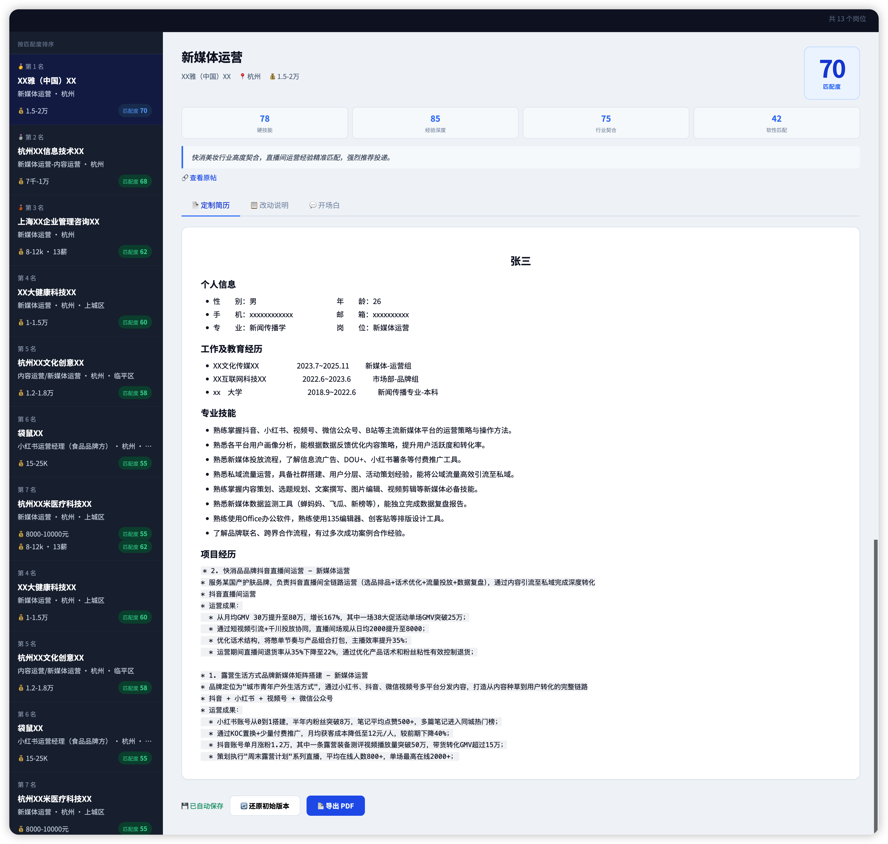
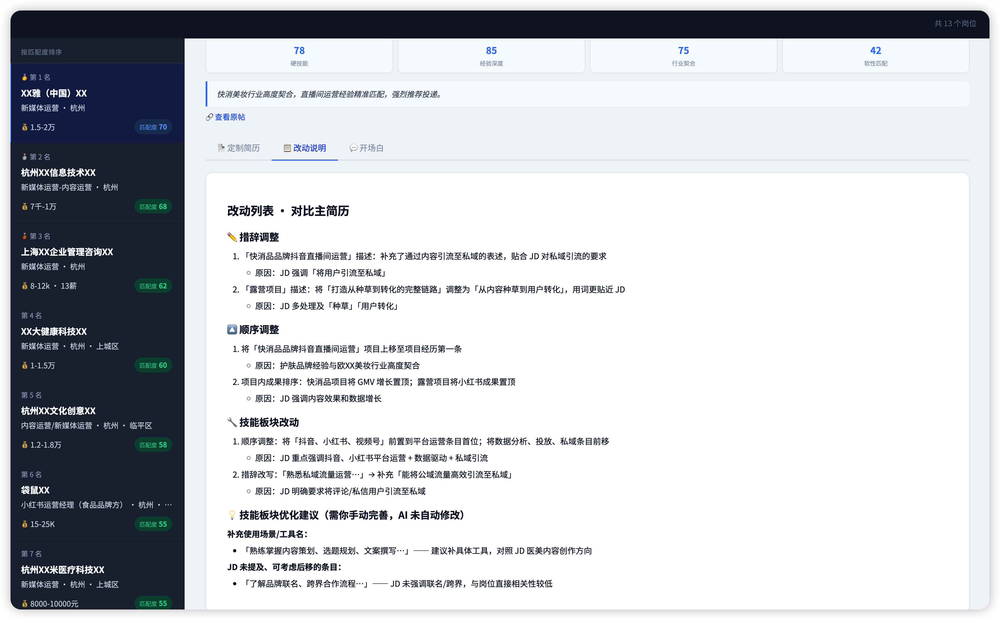
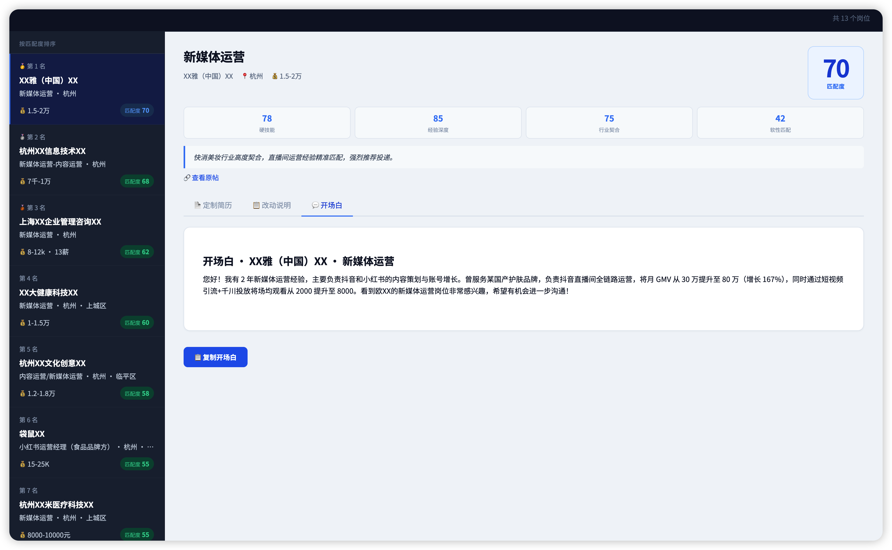

# job-hunt · 求职猎手-简历助手 skill

[English](README.en.md)

作者：[抖音](https://www.douyin.com/user/MS4wLjABAAAAWo2xyaSERZ6A7j3Ln09ZOlLCaRV8r1dazBzzckknKbqcIXdARqfOV11SZAeJapEM) · [小红书](https://www.xiaohongshu.com/user/profile/62a1d0dd000000001b029ddd)

**简历投出去没动静？问题可能不是你不够好，是你的简历没对上那个 JD。**

HR 扫一眼的时间不到 10 秒——**简历和 JD 的匹配度，才是能不能过初筛的关键。**

**job-hunt 是一个装在 agent 里的 AI skill**：你把简历和一批岗位发给它，它会自动针对每一个 JD 完成「解析 → 匹配 → 改写简历 → 写开场白」，最后产出一个按匹配度排序的 HTML 报告。一次发 5 个、10 个、20 个岗位都行，它能帮你一次性产出。

> 你决定投谁，AI 把每一份简历准备到位。

---

## 它能 / 不能帮你做什么

**能做的（3 步全自动）**：

1. **评估简历**：按行业实用标准（场景 + 行动 + 结果）逐段诊断，指出薄弱点并给改写建议
2. **解析 + 匹配**：把岗位详情转成结构化 JD，用 STAR 框架与你的简历做 4 维匹配（硬技能 / 经验深度 / 行业契合 / 软性匹配）
3. **批量定制 + 排序**：针对每个 JD 重写一份简历 + 开场白 + 改动说明，汇总到一个 HTML，按匹配度排序

**不会做的（伦理红线）**：

- ❌ 不凭空增加项目、技能或公司经历
- ❌ 不编造用户量、增长率、营收等数字，缺失处用 `[请填写：xxx]` 占位
- ❌ 不改工作时段、职级、公司名
- ✅ 每一处改动都写在 `changelog.md`，可逐条审查

---

## 🖼 效果预览

`/job-hunt` 跑完后会输出一个静态 HTML 文件，浏览器打开就是这样：

### 📄 定制简历

左侧按匹配度排序所有岗位，右侧展示当前岗位针对 JD 改写后的简历。
**红色高亮** `[请填写：xxx]` 是必须手动补全的内容，**黄色高亮** `[需用户确认]` 是 AI 推断、需核对真实性的内容——AI 不替你编数据。
右下角「📄 导出 PDF」可直接下载 A4 简历；「🔄 还原初始版本」可撤销在网页上的手动编辑。



### 📋 改动说明

「AI 改了什么」的完整透明度报告，按改动类型分节列出，每一处都标明改写原因。
若有需要你手动处理的内容，会以**黄色色块**整段高亮提示。



### 💬 开场白

针对当前岗位写好的 HR 第一条消息，点「📋 复制开场白」按钮直接用。



---

## 适合 / 不适合的人

**适合**

- 使用文字简历求职的岗位：产品、运营、市场、技术、管理等
- 同时投递多个岗位、需要针对不同 JD 定制简历的求职者
- 想快速了解自己与某个岗位匹配度的求职者

**可能帮助有限**

- 主要靠作品集、设计稿、成果展示求职的岗位（UI/UX、平面设计、摄影、建筑等）——核心竞争力在作品本身，文字简历定制收益有限

---

## 前置条件

- [Claude Code](https://github.com/anthropics/claude-code) 已安装（或任何支持 Skill 规范的 Agent，如 Codex、OpenClaw 等）
- 简历准备成 **`.md` 文件** 或 **可粘贴的文本**——PDF/Word 请先转出文本
- 岗位来源任选其一：
  - **截图模式**：任意招聘平台详情页截图；**要求大模型具备视觉能力（能识图）**
  - **Chrome 插件模式**：用插件收藏后导出 `.jobs.json`；对大模型无视觉要求（当前覆盖 Boss 直聘、前程无忧、智联招聘、猎聘）

---

## 快速开始（30 秒上手）

```bash
# 1. 装 skill
npx skills add JPCwhj/job-hunt -g -y --all
```

```
# 2. 在 Claude Code 里运行
/job-hunt

# 3. 跟着提示走：发简历 → 发岗位（截图或 .jobs.json）→ 等结果
```

跑完会在 `<当前目录>/jobHuntSkillData/output/<run_id>/shortlist.html` 生成一个 HTML，浏览器打开即可。

---

## 安装/更新 Skill（安装和更新同一条命令）

```bash
npx skills add JPCwhj/job-hunt -g -y --all
```

---

## 安装浏览器插件（可选）

如果不想截图，可以装一个浏览器插件直接收藏岗位再批量导出。**已支持 Boss 直聘、前程无忧、智联招聘、猎聘四个平台**。

1. 获取仓库代码（任选一种方式）：
   - 克隆：`git clone https://github.com/JPCwhj/job-hunt.git`
   - 或点本仓库右上角绿色 **Code → Download ZIP** 下载压缩包，解压到任意位置
2. 打开 Chrome，访问 `chrome://extensions/`
3. 右上角打开"开发者模式"
4. 加载插件（任选一种方式）：
   - 点"加载已解压的扩展程序"，选择仓库下的 `chrome-extension/` 目录
   - 或直接把 `chrome-extension/` 文件夹拖进 `chrome://extensions/` 页面
5. 安装成功后，在任意支持平台的岗位详情页右下角会出现"⭐ 加入清单"按钮（按钮可拖拽到任意位置，四个平台共享同一位置）

**使用流程**：

- 在任一支持平台的岗位详情页点"⭐ 加入清单"，攒到一批
- 点浏览器右上角插件图标，勾选要导出的岗位
- 点"导出"，`.jobs.json` 文件下载到浏览器默认 Downloads 目录（导出成功后已导出的岗位会自动从收藏列表清空）
- 启动 `/job-hunt` 流程，等走到「上传岗位」那一步时再把 `.jobs.json` 文件发给 AI（不是一开始就发）

**未覆盖的平台**：继续用截图方式。

---

## 详细使用流程

在你的 agent 工具里运行 `/job-hunt`（Claude Code、Codex、OpenClaw 等均可）：

1. 提供简历（发文件、告知路径，或直接粘贴文本）
2. AI 自动评估简历质量，给出逐段建议；可选择修改后重传，或直接继续
3. 提供岗位详情（任选一种方式）：
   - **截图**：上传任意招聘平台详情页截图（一张截图 = 一个岗位，信息长请用长截图截全；截图里至少有岗位名）
   - **Chrome 插件**：批量收藏岗位后导出 `.jobs.json`，把文件发给 AI
4. 岗位导入后自动进入匹配分析与简历定制，无需额外触发
5. 查看 shortlist，回填占位符，手动投递

**换简历重跑**：改完简历后再次运行 `/job-hunt`，会提示你发新简历，直接发过去即可替换，无需 clean。新简历会自动触发质量评估，给出逐段建议。

### 子命令

| 命令 | 作用 |
|---|---|
| `/job-hunt` | 完整流程（岗位导入 → 分析 → 生成三件套 → shortlist） |
| `/job-hunt fetch` | 只导入岗位（截图或插件 JSON 均可） |
| `/job-hunt analyze` | 只做匹配分析（基于已有 jd-pool） |
| `/job-hunt tailor` | 排序 + 生成定制简历 |
| `/job-hunt status` | 查看当前进度 |
| `/job-hunt clean` | 清理所有缓存和输出 |

---

## 输出文件结构

```
<当前目录>/
└── jobHuntSkillData/             ← 所有数据统一放在这里
    ├── .work/
    │   ├── resume.md             ← 你提供的简历（自动保存）
    │   └── jd-pool/              ← 解析后的 JD 缓存
    └── output/
        └── 2026-05-02-1430/      ← 每次运行一个目录
            ├── shortlist.html    ← 最终视图（在浏览器打开）
            ├── state.json        ← 断点续跑状态
            └── tailored/
                └── <公司名-职位名>/
                    ├── resume.md     ← 定制简历
                    ├── opener.md     ← 开场白
                    └── changelog.md  ← AI 改了什么（透明度保险）
```

`shortlist.html` 是静态单 HTML 文件：

- 桌面 + 移动端响应式
- 按匹配度排序查看所有岗位
- 简历可在网页直接编辑，自动保存到浏览器本地
- 每个岗位一键导出 PDF（A4，内嵌思源黑体跨平台一致）
- 切换查看每个岗位的简历 / 改动 / 开场白

---

## 设计边界 & 数据安全

- **支持的平台**：截图模式不限平台；Chrome 插件目前覆盖 Boss 直聘、前程无忧、智联招聘、猎聘
- **不做自动投递**：避免封号风险 + 守住伦理边界，由你手动投递
- **全部本地存储**：简历、JD、定制简历等全部写入 `jobHuntSkillData/` 目录，不会自动上传或同步
- **链路与 Claude 一致**：skill 不连接任何第三方服务器，数据处理与你直接使用 Claude 完全相同
- **skill 源码可查**：纯文本指令，无任何网络请求代码，路径 `~/.claude/skills/`

---

## 许可证

© 2026 [JPCwhj](https://github.com/JPCwhj) · [CC BY-NC 4.0](https://creativecommons.org/licenses/by-nc/4.0/)

- 个人使用、学习、研究、非商业项目：不需要署名，不需要申请
- 公开发布衍生作品（文章、工具、课程等）：请注明来源
- 商业用途：需要单独授权，请联系：syxxczbwhj@foxmail.com
