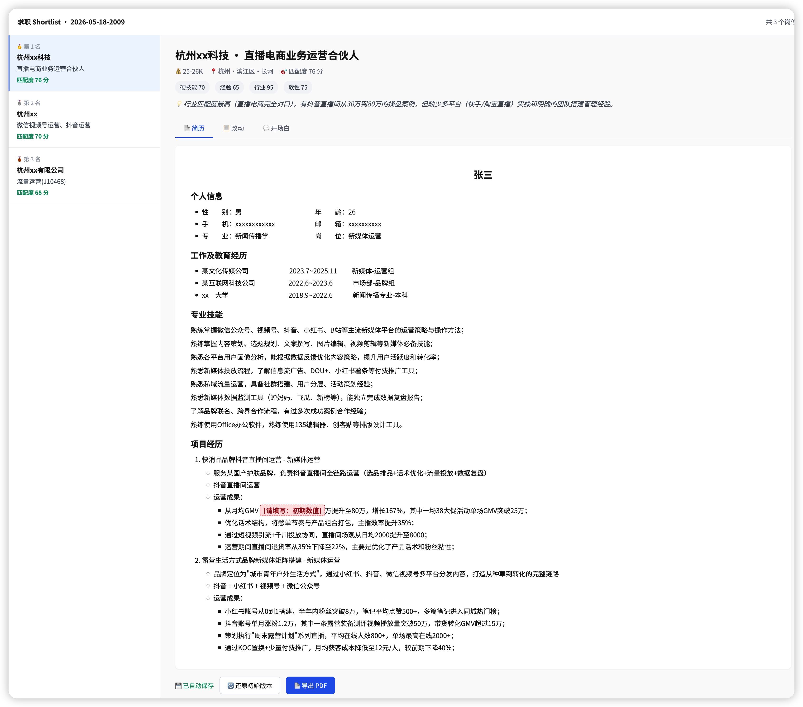
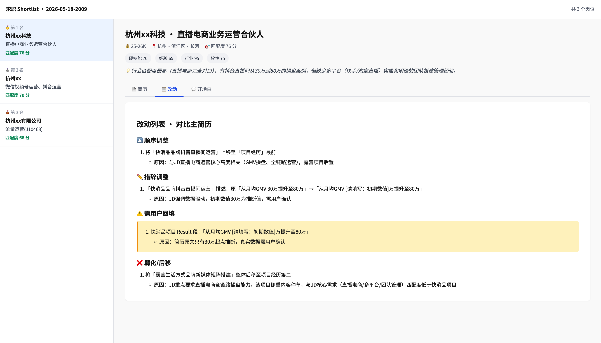
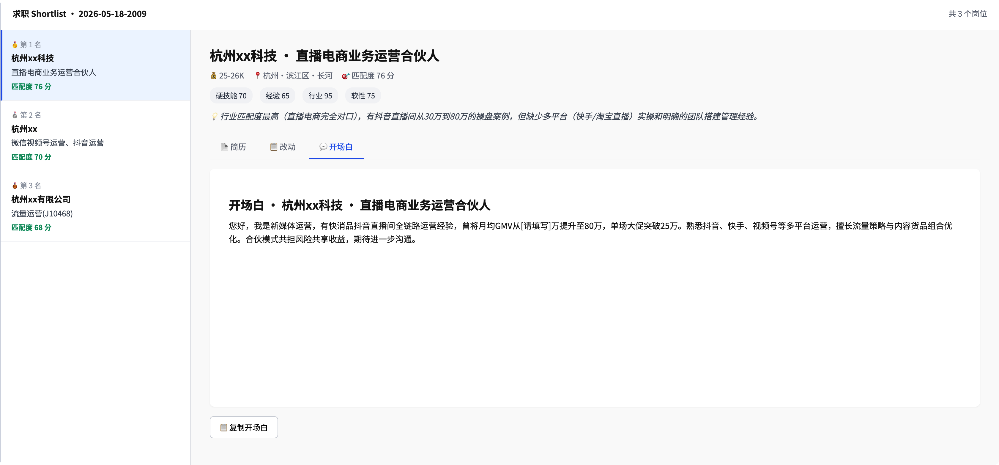

# job-hunt · 求职猎手-简历助手 skill

[English](README.en.md)

作者：[抖音](https://www.douyin.com/user/MS4wLjABAAAAWo2xyaSERZ6A7j3Ln09ZOlLCaRV8r1dazBzzckknKbqcIXdARqfOV11SZAeJapEM) · [小红书](https://www.xiaohongshu.com/user/profile/62a1d0dd000000001b029ddd)

**简历投出去没动静？问题可能不是你不够好，是你的简历没对上那个 JD。**

HR 扫一眼的时间不到 10 秒——**简历和 JD 的匹配度，才是能不能过初筛的关键。**

**一次截 5 个、10 个、20 个岗位都行——批量发给 AI，自动对每一个 JD 完成「解析 → 匹配 → 简历定制 → 开场白」全流程，最后把所有岗位按匹配度排序汇总到一个 HTML，让你一眼看出该重点投哪几家。**

> 你决定投谁，AI 把每一份准备到位。

---

## 它能帮你做什么

1. **评估简历质量**：上传简历后，AI 按行业实用标准（场景 + 行动 + 结果）逐段诊断，指出薄弱点并给出改写方向；你可以当场修改重传，也可以先跳过继续
2. **解析 JD**：上传招聘平台详情页截图（Boss直聘、智联招聘、前程无忧、猎聘、拉勾等均可），AI 自动提取结构化信息（职位、薪资、要求、公司规模等）
3. **匹配分析**：把每条 JD 和你的简历做 STAR 对齐，输出 4 个维度的匹配分（硬技能 / 经验深度 / 行业契合 / 软性匹配）
4. **生成三件套**：针对每个 JD 重新「对焦」你的简历——相关经历前移、匹配点强化，读完这份简历的 HR 能一眼看出你符合这个岗位；附开场白 + 改动说明
5. **输出 shortlist**：所有岗位按匹配度从高到低汇总到一个静态 HTML 文件，浏览器打开即可逐条查看每个岗位的定制简历 / 改动说明 / 开场白；简历支持在网页上直接修改，一键导出 PDF（中文字体跨平台一致）

---

## ⚡ 批量是核心能力

**这不是「让 AI 帮你写一份简历」，而是「让 AI 同时帮你针对 N 个岗位各写一份」。**

| 场景 | 传统方式 | 用 job-hunt |
|---|---|---|
| 投 10 个岗位 | 一个一个研究 JD、改简历、写开场白，**预计 1 天** | 截 10 张图发给 AI，**几分钟跑完 10 份定制材料** |
| 决定投谁 | 凭感觉 | 按匹配度排序，**数据驱动决策** |
| 评估标准 | 主观、易疲劳 | AI 用同一套 STAR 标准，**一致性高** |

你截多少张岗位截图，AI 就给你产出多少份定制简历——5 个、10 个、20 个都行。

---

## 它不会帮你做什么

- **不凭空增加经历**：不添加你简历里没有的项目、技能或公司经历
- **不编造数字**：遇到缺量化数据的地方，只插入 `[请填写：xxx]` 占位，不替你捏造用户量、增长率、营收等具体数字
- **不改关键事实**：工作时段、职级、公司名称不会被修改
- **不偷偷改**：每一处改动都记录在 `changelog.md`，改了什么、为什么改，你可以逐条审查

---

## 🖼 效果预览

`/job-hunt` 跑完后会输出一个静态 HTML 文件，浏览器打开就是这样：

### 📄 定制简历

左侧按匹配度排序所有岗位，右侧展示当前岗位针对 JD 改写后的简历。
**红色/黄色高亮**的部分是需要你回填或核实的占位符（AI 不替你编数据）。
底部的「📄 导出 PDF」按钮可直接下载 A4 简历，中文字体跨平台一致。



### 📋 改动说明

「AI 改了什么」的完整透明度报告：顺序调整 / 措辞改写 / 需用户回填 / 弱化后移，每一处都标明改写原因。**黄底高亮的「需用户回填」**部分是 AI 推断、需要你核实的内容。



### 💬 开场白

针对当前岗位写好的 HR 第一条消息（控制在 200 字内），点「📋 复制开场白」按钮直接用。



---

## 适合人群

**适合**
- 使用文字简历求职的岗位：产品、运营、市场、技术、管理等
- 同时投递多个岗位、需要针对不同 JD 定制简历的求职者
- 想快速了解自己与某个岗位匹配度的求职者

**可能帮助有限**
- 主要靠作品集、设计稿、成果展示求职的岗位（UI/UX、平面设计、摄影、建筑等）——核心竞争力在作品本身，文字简历定制收益有限

---

## 安装或更新

```bash
npx skills add JPCwhj/job-hunt -g -y
```

---

## 浏览器插件（可选，仅 Boss 直聘）

如果你主要在 Boss 直聘投递，可以装一个浏览器插件代替截图，体验更快：

1. 克隆本仓库：`git clone https://github.com/JPCwhj/job-hunt.git`
2. 打开 Chrome，访问 `chrome://extensions/`
3. 右上角打开"开发者模式"
4. 点"加载已解压的扩展程序"，选择仓库下的 `chrome-extension/` 目录
5. 安装成功后，在 Boss 详情页右下角会出现"⭐ 加入清单"按钮

**使用流程**：
- Boss 详情页点"⭐ 加入清单"，攒到一批
- 点浏览器右上角插件图标，勾选要导出的岗位
- 点"导出"，文件下载到浏览器默认 Downloads 目录
- 把 `.jobs.json` 文件拖给 Claude Code 的 `/job-hunt` 流程

**其他平台请继续用截图方式**。

---

## 使用方式

**方式一**：启动任意支持 skill 的 agent 工具，运行对应命令：
- Claude Code：`/job-hunt`
- Codex：`$job-hunt`

**方式二**：在 OpenClaw 等本地 AI agent 工具的对话窗口中，发送：

```
/job-hunt
```

**流程如下**：
1. 提供简历（发文件、告知路径，或直接粘贴文本）
2. AI 自动评估简历质量，给出逐段建议；可选择修改后重传，或直接继续
3. 上传招聘平台岗位详情页截图
   📌 一张截图 = 一个岗位（信息长请用长截图截全）；截图里至少有岗位名（公司名可选）
4. 截图确认后自动进入匹配分析与简历定制，无需额外触发
5. 查看 shortlist，回填占位符，手动投递

**换简历重跑**：改完简历后再次运行 `/job-hunt`，会提示你发新简历，直接发过去即可替换，无需 clean。

### 子命令

| 命令 | 作用 |
|---|---|
| `/job-hunt` | 完整流程（截图导入 → 分析 → 生成三件套 → shortlist） |
| `/job-hunt fetch` | 只导入截图（解析 JD 到 jd-pool） |
| `/job-hunt analyze` | 只做匹配分析（基于已有 jd-pool） |
| `/job-hunt tailor` | 排序 + 生成定制简历 |
| `/job-hunt status` | 查看当前进度 |
| `/job-hunt clean` | 清理所有缓存和输出 |

---

## 前置条件


- **你的大模型有视觉能力，能识别图片**（用于截图解析）
- [Claude Code](https://github.com/anthropics/claude-code) 已安装（或任何支持 Skill 规范的 Agent，如 Codex、OpenClaw 等）
- 简历需准备成 **`.md` 文件** 或 **可直接粘贴的文本**——版式文件（PDF/Word）请先用阅读器全选复制内容或另存为 `.md` 后再发
- 任意招聘平台（Boss直聘、智联招聘、前程无忧、猎聘、拉勾等）截取岗位详情页截图即可
- 📌 **截图规则：一张截图 = 一个岗位**。岗位信息长就用长截图把内容截在一张图里；截图里**至少要有岗位名称**（公司名可选，没截到也行）


---

## 输出文件结构

```
<当前目录>/
└── jobHuntSkillData/             ← 所有数据统一放在这里
    ├── .work/
    │   ├── resume.md             ← 你提供的简历（自动保存）
    │   └── jd-pool/              ← 解析后的 JD 缓存
    └── output/
        └── 2026-05-02-1430/      ← 每次运行一个目录
            ├── shortlist.html    ← 最终视图（在浏览器打开）
            ├── state.json        ← 断点续跑状态
            └── tailored/
                └── <公司名-职位名>/
                    ├── resume.md     ← 定制简历
                    ├── opener.md     ← 开场白
                    └── changelog.md  ← AI 改了什么（透明度保险）
```

### 输出格式

`shortlist.html`：静态单 HTML 文件，复制路径到浏览器打开即可：
- 桌面 + 移动端响应式
- 按匹配度排序查看所有岗位
- 简历可在网页直接编辑，自动保存到浏览器本地
- 每个岗位一键导出 PDF（A4，内嵌思源黑体跨平台一致）
- 切换查看每个岗位的简历 / 改动 / 开场白

---

## 设计边界

- **支持所有主流招聘平台**：截图包含公司名、职位名、岗位 JD 即可，不限平台
- **不做自动投递**，避免封号风险
- **不依赖任何插件或扩展**：你截图，AI 解析，无需浏览器插件或 MCP 工具

---

## 数据安全

- **所有文件保存在本机**：简历、JD、定制简历等全部写入本地 `jobHuntSkillData/` 目录，路径透明，不会自动上传或同步到任何地方
- **内容只经过你已在用的 Claude**：skill 不连接任何第三方服务器，数据处理链路与你直接使用 Claude 完全相同
- **skill 本身是纯文本指令**：无任何网络请求代码，可直接查看 `~/.claude/skills/` 下的源文件

